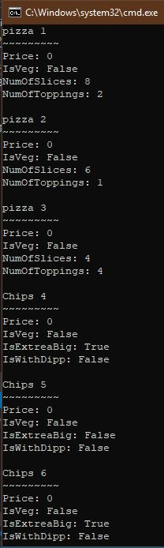

# Exercise Class lession8

* code

```Csharp Main Program
using System;

namespace Lession8CSharp
{
    class Program
    {
        static void Main(string[] args)
        {
            Food[] arr = new Food[6];
            arr[0] = new Pizza(2, 8,15,true);
            arr[1] = new Pizza(1, 6,15, true);
            arr[2] = new Pizza(4, 4, 15, false);
            arr[3] = new Chips(true, false, 10, true);
            arr[4] = new Chips(false, false, 12, true);
            arr[5] = new Chips(true, true, 14, true);

            for (int i = 0; i < 6; i++)
            { 
                if(arr[i] is Pizza)
                    Console.Write($"pizza {i+1}\n~~~~~~~~~\nPrice: {((Pizza)arr[i]).Price}\nIsVeg: {((Pizza)arr[i]).IsVeg}\nNumOfSlices: {((Pizza)arr[i]).NumOfSlices}\nNumOfToppings: {((Pizza)arr[i]).NumOfToppings}\n\n");
                else
                    Console.Write($"Chips {i + 1}\n~~~~~~~~~\nPrice: {((Chips)arr[i]).Price}\nIsVeg: {((Chips)arr[i]).IsVeg}\nIsExtreaBig: {((Chips)arr[i]).IsExtreaBig}\nIsWithDipp: {((Chips)arr[i]).IsWithDipp}\n\n");
            }
        }
    }
}
```
***

```Class Food

namespace Lession8CSharp
{
    class Food
    {
        private double price;

        public double Price
        {
            get { return price; }
            set { price = value; }
        }

        public bool IsVeg { get; set; }

        public Food(double Price, bool isVeg)
        {
            Price = price;
            IsVeg = IsVeg;
        }

    }
}

```

***

```Class Pizaa
namespace Lession8CSharp
{
    class Pizza:Food
    {
        private int numOfSlices;

        public int NumOfSlices
        {
            get { return numOfSlices; }
            set { numOfSlices = value; }
        }

        private int numOfToppings;

        public int NumOfToppings
        {
            get { return numOfToppings; }
            set { numOfToppings = value; }
        }

        public Pizza(int numOfToppings, int numOfSlices,double Price,bool isVeg) :base (Price,isVeg)
        {
            NumOfSlices = numOfSlices;
            NumOfToppings = numOfToppings;
        }
    }
}

```

***
```Class Chips
namespace Lession8CSharp
{
    class Chips:Food
    {
        private bool isExtreaBig;

        public bool IsExtreaBig
        {
            get { return isExtreaBig; }
            set { isExtreaBig = value; }
        }

        private bool isWithDipp;

        public bool IsWithDipp
        {
            get { return isWithDipp; }
            set { isWithDipp = value; }
        }


        public Chips(bool isExtreaBig,bool IsWithDipps, double Price, bool isVeg) : base(Price, isVeg)
        {
            IsExtreaBig = isExtreaBig;
            IsWithDipp = isWithDipp;
        }
    }
}

```
* Result:


